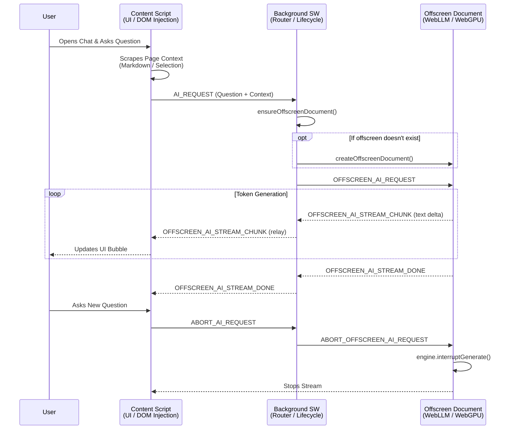

# EzyBuddy Chrome Extension

EzyBuddy is a privacy-first, purely local AI browser assistant designed to help users interact with webpages, summarize content, and answer questions entirely offline. It leverages modern web technologies and the power of WebGPU to run a local language model (Qwen2.5-0.5B-Instruct-q4f16) directly in the user's browser without sending any data to a remote server.

## Key Features

- **100% Local & Private**: No API keys required. No data leaves your machine. The AI runs directly in your browser using WebGPU.
- **Context-Aware Assistance**: Automatically reads and understands the active webpage, allowing you to ask relevant questions.
- **Modern Glassmorphic UI**: Beautiful, fully responsive floating action panel built with pure Vanilla TypeScript/CSS.
- **Interruption Support**: Seamlessly abort and replace ongoing slow generations if you decide to ask a new question.

## Tech Stack

- **Vanilla TypeScript & DOM API**: Lightweight, dependency-free UI logic injected directly into the host page.
- **ESBuild**: Fast, robust bundling tailored for Chrome Extensions.
- **Manifest V3**: The latest Chrome Extension specification ensuring high performance and security.
- **@mlc-ai/web-llm**: The core AI engine wrapping TVM/WebGPU to execute open-source LLMs locally at high speeds.

## Extension Architecture Diagram

Running heavy AI models within a Chrome Extension requires careful choreography due to the lifecycle limitations of Manifest V3 Service Workers.

The architecture centers around the `Offscreen Document`, which provides a persistent, DOM-enabled execution environment where WebGPU can run uninterrupted. Messages act as the circulatory system, passing the WebLLM stream back out to the UI.



### Component Details

1. **Content Script (`src/content/main.ts`)**
   - Injected into every page `<all_urls>`.
   - Mounts the isolated Glassmorphism UI panel.
   - Extracts semantic data from the host page using `src/content/pageAnalyzer.ts`.
   - Handles the custom element streaming update updates and the dev utility `window.dispatchEvent(new CustomEvent("eb:clear-cache"))`.
2. **Background Service Worker (`src/background/index.ts`)**
   - Acts as the central nervous system.
   - Responsible for spawning the Offscreen Document.
   - Validates incoming payload authority to prevent malicious host pages from mimicking the extension UI.
   - Relays large message chunk streams from the Offscreen Document to the active Tab.
3. **Offscreen Document (`src/offscreen/index.ts`)**
   - Contains the `@mlc-ai/web-llm` engine.
   - Because it's a hidden HTML document, it isn't subject to the aggressive 30-second suspension limits of the background Service Worker, meaning the AI can take its time spinning up or generating large responses.

## Development Commands

- `npm run build`: Bundles the TypeScript to the `dist` folder.
- `npm run dev`: (Optional alias) Can be mapped to file watch mode.
- `zip -r ezybuddy.zip dist`: Pack the extension for sharing.

**Debugging the AI Cache:**
To test the fresh install experience (re-triggering the model download), open the Chrome DevTools console on any page and execute:

```javascript
document.dispatchEvent(new CustomEvent('eb:clear-cache'));
```

## Security & CSP

To allow the AI model to fetch multi-GB chunks from HuggingFace Content Delivery Networks, the wildcard Content Security Policy `connect-src 'self' https://* wss://*;` is intentionally applied.
